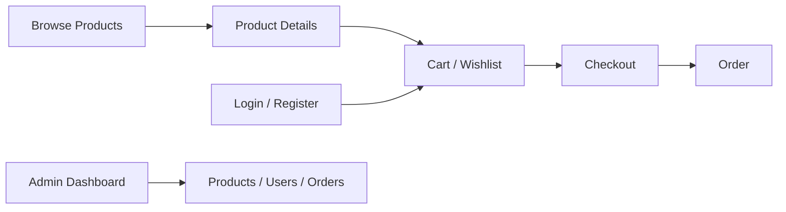

# Arabic Coffee Shop E-commerce Website


A complete Arabic **PHP + MySQL e-commerce project** for a coffee and tea store. It includes a customer storefront and an administration area for managing products, users, and orders.

## Portfolio Proof

| Area | Evidence |
|---|---|
| **Problem** | Build an Arabic database-backed storefront that covers the core customer and administration workflows of a small e-commerce operation. |
| **Solution** | PHP/PDO application with authentication, product browsing, cart, wishlist, checkout, orders, and an admin area. |
| **Storefront** | [home.php](home.php) |
| **Checkout** | [checkout.php](checkout.php) |
| **Administration** | [dashboard.php](dashboard.php) · [admin_orders.php](admin_orders.php) |
| **Database** | [shop_db.sql](shop_db.sql) |
| **Current status** | Local PHP/MySQL project; the repository does not claim a production deployment. |


## Features

- Arabic RTL storefront.
- Product browsing and product detail pages.
- User registration and login.
- Shopping cart and wishlist.
- Checkout and order workflows.
- Customer account/profile handling.
- Admin dashboard.
- Add and update products.
- User management.
- Order management and status updates.
- Responsive storefront styling.

## Tech Stack

- PHP
- MySQL
- PDO
- HTML5
- CSS3
- JavaScript
- PHP Sessions
- SweetAlert
- Boxicons / Font Awesome

## Customer Flow



## Project Structure

The repository includes customer-facing pages such as:

```text
home.php
view_products.php
cart.php
wishlist.php
checkout.php
order.php
login.php
register.php
about.php
contact.php
```

Administration functionality includes:

```text
dashboard.php
add_products.php
update_product.php
admin_orders.php
user_accounts.php
admin_header.php
```

Reusable elements and the database connection live under `components/`.

## Database

A database export is included as:

```text
shop_db.sql
```

The current development connection expects a local MySQL database named `shop_db`.

For a production deployment, move database credentials out of source code and load them from environment/server configuration.

## Local Setup

1. Install a PHP/MySQL environment such as XAMPP, Laragon, or an equivalent stack.
2. Import `shop_db.sql` into MySQL.
3. Configure `components/connection.php` for your local database credentials.
4. Serve the repository through your PHP web server.
5. Open `index.php` or `home.php`.

## What This Project Demonstrates

This project covers the fundamentals of a database-backed e-commerce application: authentication, session state, CRUD operations, product management, ordering, customer flows, and an Arabic RTL interface.
